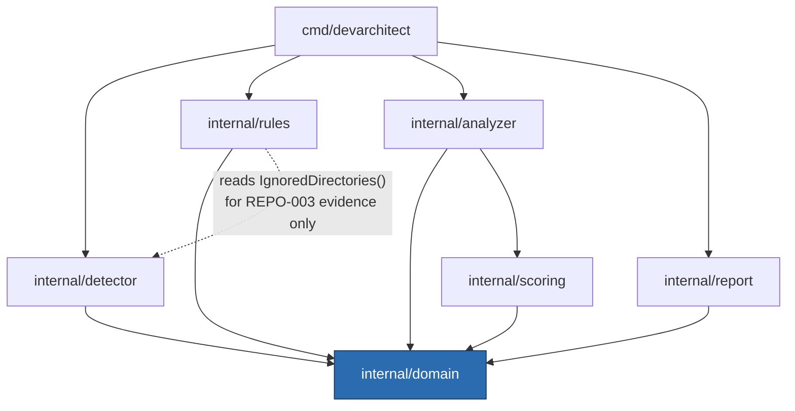
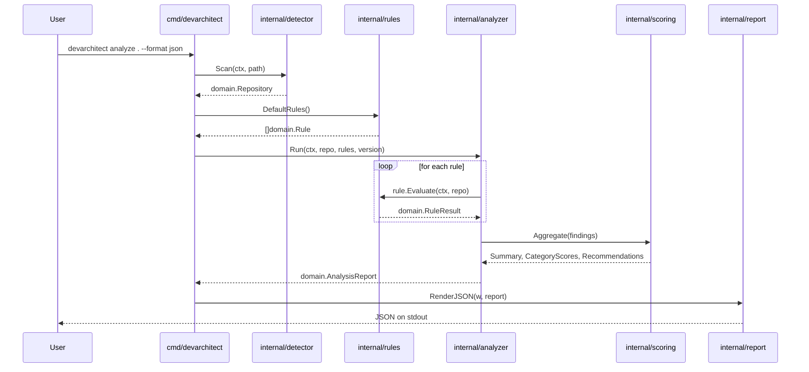

# Architecture Overview

## Table of contents

- [Summary](#summary)
- [Components](#components)
- [Responsibilities](#responsibilities)
- [Data flow](#data-flow)
- [Package dependency graph](#package-dependency-graph)
- [Sequence: `devarchitect analyze`](#sequence-devarchitect-analyze)
- [Why this shape](#why-this-shape)
- [Related documents](#related-documents)

## Summary

DevArchitect AI is a pipeline, not a monolith. A single CLI invocation
flows through five independently-testable stages — scan, evaluate,
aggregate, orchestrate, render — each owned by one package, each
communicating with the next through a plain Go value (never a shared
mutable state, a global, or a side channel). This document describes that
pipeline as it exists today, after Milestones 0-2 (see the
[Roadmap](../roadmap/roadmap.md)).

For *why* the system is shaped this way, see
[Separation of concerns](../vision/design-principles.md#separation-of-concerns)
and the [ADRs](../adr/); this document describes *what* exists, not why it
was decided.

## Components

| Package | Role |
|---|---|
| `cmd/devarchitect` | CLI entrypoint: argument parsing, command dispatch, wiring every other package together. |
| `internal/domain` | Core types shared by every other package: `Repository`, `Rule`, `RuleResult`, `Finding`, `AnalysisReport`, `Category`, `Status`, `Impact`. No logic, no dependencies on any other internal package. |
| `internal/detector` | Safe, read-only repository scanning. Turns a file system path into a `domain.Repository`. |
| `internal/rules` | The 17 built-in `domain.Rule` implementations and their registry (`DefaultRules()`). |
| `internal/analyzer` | Orchestrates rule evaluation: runs every rule against a `Repository`, recovers from panics, assembles the final `AnalysisReport`. |
| `internal/scoring` | Pure aggregation math: turns a slice of `domain.Finding` into per-category scores, an overall summary, and ordered recommendations. |
| `internal/report` | Renders a `domain.AnalysisReport` for humans (terminal) or machines (JSON). |
| `internal/config` | Reserved for `.devarchitect.yml` support (Milestone 3 — see [Roadmap](../roadmap/roadmap.md)). Not yet implemented. |

See [components.md](components.md) for each package's full contract: what
it may depend on, what it may never depend on, and worked examples.

## Responsibilities

The pipeline is deliberately organized around one question per stage:

1. **What is true about this repository?** — `internal/detector`. Facts
   only: file paths, detected languages, whether a README exists and what
   it says. No judgment.
2. **What does each fact mean?** — `internal/rules`. Seventeen
   independent, evidence-based judgments, each producing one
   `domain.RuleResult`.
3. **How do those judgments become numbers?** — `internal/scoring`. Pure
   arithmetic over `domain.Finding` values: no file system access, no
   knowledge of what a rule checks, only how `passed`/`failed`/`skipped`/
   `error` statuses affect a score (see
   [ADR-005](../adr/ADR-005-transparent-deterministic-scoring.md)).
4. **How does the whole thing run safely?** — `internal/analyzer`. Runs
   every rule, guarantees one broken rule can't take down the others or
   hide its own failure, and assembles the final report.
5. **How is the result shown?** — `internal/report`. Same data, two
   renderings; no rendering-specific logic leaks upstream into the
   engine.

## Data flow

```mermaid
flowchart LR
    A["User\ndevarchitect analyze ."] --> B["cmd/devarchitect\nparse args"]
    B --> C["internal/detector\nScan(path)"]
    C --> D["domain.Repository\n(files, languages,\nREADME content)"]
    D --> E["internal/rules\nDefaultRules()"]
    E --> F["internal/analyzer\nRun(repo, rules)"]
    F --> G["domain.Finding ×17\n(one per rule)"]
    G --> H["internal/scoring\nAggregate(findings)"]
    H --> I["CategoryScores +\nSummary + Recommendations"]
    F --> J["domain.AnalysisReport"]
    I --> J
    J --> K["internal/report\nRenderTerminal / RenderJSON"]
    K --> L["stdout or --output file"]
```

## Package dependency graph

Arrows point from a package to what it is allowed to import. This graph is
enforced by convention and code review today (see
[Low coupling](../vision/design-principles.md#low-coupling)); no automated
import-boundary linter exists yet, which is a known gap — see [Suggested
future improvements](#related-documents) in this document's companion,
[components.md](components.md#dependency-rules).

`internal/domain` has no outgoing arrow: it depends on nothing else in the
module, which is what makes it safe for every other package to depend on.

## Sequence: `devarchitect analyze`

Note that `internal/analyzer` recovers a panic from any single
`rule.Evaluate` call and converts it into a `Finding` with
`Status: StatusError` — this is not shown as a separate path in the
diagram above because, from every other component's point of view, it is
indistinguishable from a normal result: the analyzer always produces
exactly one `Finding` per rule, no exceptions propagate past it.

## Why this shape

Two properties fall out of this architecture directly, without needing to
be separately engineered:

- **Rules are trivially testable.** Because a rule receives a plain
  `domain.Repository` value and returns a plain `domain.RuleResult` value,
  a unit test can construct a `Repository` by hand — no file system, no
  mocking framework — and assert on the result. Every rule in
  `internal/rules` is tested exactly this way.
- **The engine is safe by construction against a broken rule.** Because
  `internal/analyzer` is the only place that calls `rule.Evaluate`, it is
  the only place that needs to guard against a panic — and it does, once,
  for every rule, rather than requiring every rule author to remember to
  add their own recovery logic.

This pipeline is about to gain a sixth stage:
[RFC-001](../rfc/RFC-001-engineering-policies.md) (Accepted 2026-08-04)
defines `internal/config` and `internal/policy`, evaluating an
`.devarchitect.yml` policy against an already-complete `AnalysisReport`
without either new package touching `internal/scoring` or
`internal/analyzer` — see that RFC's own data-flow diagram. Implementation
has not started; this overview will be updated once it lands, per
[decision-hierarchy.md](../governance/decision-hierarchy.md#how-code-relates-to-documentation).

## Related documents

- [Components](components.md) — per-package contracts, allowed/forbidden
  dependencies, and examples.
- [ADR-004](../adr/ADR-004-modular-rule-engine.md) — why the `Rule`
  interface is shaped the way it is.
- [ADR-005](../adr/ADR-005-transparent-deterministic-scoring.md) — the
  scoring math this document's data flow diagram summarizes.
- [RFC-001](../rfc/RFC-001-engineering-policies.md) — the Accepted design
  for this pipeline's next addition, not yet implemented.
- [Design principles](../vision/design-principles.md) — the values this
  architecture implements.
- [Glossary](../vision/glossary.md) — precise definitions for every term
  used in this document (Analyzer, Detector, Repository Model, and so
  on).
