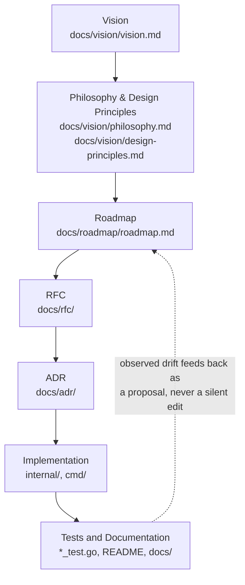

# Decision Hierarchy

## Table of contents

- [Purpose](#purpose)
- [The hierarchy](#the-hierarchy)
- [The governing rule](#the-governing-rule)
- [Authority of each artifact](#authority-of-each-artifact)
- [What each layer must not contain](#what-each-layer-must-not-contain)
- [When artifacts contradict each other](#when-artifacts-contradict-each-other)
- [Which artifact updates first](#which-artifact-updates-first)
- [When an RFC is required](#when-an-rfc-is-required)
- [When an ADR is required](#when-an-adr-is-required)
- [When a pull request alone is enough](#when-a-pull-request-alone-is-enough)
- [How code relates to documentation](#how-code-relates-to-documentation)
- [Correcting obsolete decisions](#correcting-obsolete-decisions)
- [Marking an RFC or ADR as superseded](#marking-an-rfc-or-adr-as-superseded)
- [Related documents](#related-documents)

## Purpose

DevArchitect AI is governed by seven kinds of artifact — Vision,
Philosophy and Design Principles, Roadmap, RFCs, ADRs, Implementation, and
Tests/Documentation — each with different authority, different lifetime,
and different rules for how it can change. This document is the single
place that defines how they relate, so that "which document wins" is
never a judgment call made differently by different contributors.

This document is itself governed by [Governance](governance.md): who may
change it, and under what process, is defined there, not here.

## The hierarchy

Each layer is more concrete, more specific, and shorter-lived than the one
above it. A layer may narrow what a higher layer allows; it may never
widen it, and it may never contradict it without that higher layer
changing first — see [When artifacts contradict each
other](#when-artifacts-contradict-each-other).

## The governing rule

> Higher-level product intent guides lower-level technical decisions,
> while accepted technical decisions constrain implementation.

Two consequences follow directly from this rule:

- **Downward guidance:** [Vision](../vision/vision.md) shapes
  [Philosophy](../vision/philosophy.md), which shapes the
  [Roadmap](../roadmap/roadmap.md), which shapes what RFCs get written,
  which shape what ADRs get accepted, which shape what gets implemented.
  A change at any layer should be traceable, in principle, back up this
  chain to a reason in the Vision.
- **Upward constraint:** once an RFC is accepted or an ADR is recorded, it
  constrains implementation — code may not silently contradict it.
  Implementation is not free to reinterpret an accepted design; if the
  design turns out to be wrong, the RFC or ADR is revisited formally (see
  [Correcting obsolete decisions](#correcting-obsolete-decisions)), not
  quietly worked around in code.

## Authority of each artifact

| Layer | Authority | Lifetime | Changed by |
|---|---|---|---|
| **Vision** ([docs/vision/vision.md](../vision/vision.md)) | Defines what DevArchitect AI is and is not, for whom, and why. The final word on scope. | Long-lived; expected to be stable for years. | Rare, deliberate revision — see [Governance](governance.md#decision-process). |
| **Philosophy & Design Principles** ([docs/vision/philosophy.md](../vision/philosophy.md), [docs/vision/design-principles.md](../vision/design-principles.md)) | Defines the values and code-level rules every decision below must be consistent with. | Long-lived; principles are added rarely, and removed even more rarely. | Deliberate revision, same as Vision. |
| **Roadmap** ([docs/roadmap/roadmap.md](../roadmap/roadmap.md)) | The single source of truth for what's being built, in what order, and why — see the roadmap's own [How to read this roadmap](../roadmap/roadmap.md#how-to-read-this-roadmap). | Medium-lived; milestones move through statuses over months to years. | A pull request updating scope, status, or milestone content — see [Governance](governance.md#decision-process). |
| **RFC** ([docs/rfc/](../rfc/)) | Authoritative *proposed design* for a significant change, while in `Draft`/`In Review`; authoritative *accepted design* once `Accepted`, until implemented or superseded. | Short-to-medium-lived: resolved (accepted, rejected, or withdrawn) within a bounded discussion period, then either implemented or archived. | The RFC process — see [docs/rfc/README.md](../rfc/README.md). |
| **ADR** ([docs/adr/](../adr/)) | Permanent record of a specific technical decision already made: its context, the decision, and its consequences. | Permanent — an ADR is never deleted or rewritten after acceptance, only superseded (see [below](#marking-an-rfc-or-adr-as-superseded)). | Written once, at decision time; never edited to retroactively change the decision it records. |
| **Implementation** (`internal/`, `cmd/`) | Authoritative on *current, actual behavior*. | Continuously evolving. | Pull requests, constrained by every layer above. |
| **Tests and Documentation** | Authoritative on *what current behavior is guaranteed and explained to be*. | Continuously evolving, in lockstep with implementation. | The same pull request that changes the behavior it describes — never a separate, deferred one. |

## What each layer must not contain

- **Vision must not contain implementation details.** It describes
  problems, users, and boundaries — never a package name, a function
  signature, or a file format. If a vision statement starts describing
  *how* something works, that content belongs in an RFC or ADR instead.
- **Philosophy and Design Principles must not contain milestone-specific
  or feature-specific detail.** They state durable rules ("every score
  must be explainable"), not "Milestone 3 must have a `--fail-below`
  flag" — that belongs in the Roadmap or an RFC.
- **The Roadmap must not contain a technical design.** It states what
  ships and why, with acceptance criteria — not schemas, interfaces, or
  algorithms. Those belong in the RFC that precedes implementation.
- **An RFC must not contain a decision that hasn't been reasoned through.**
  Every design choice needs stated alternatives and consequences (see the
  [RFC template](../rfc/RFC-000-template.md)) — an RFC is not a place to
  assert a conclusion without argument.
- **An ADR must not re-litigate a decision.** It records what was decided
  and why, after the fact — it is not a discussion document. If a
  decision needs discussion first, that discussion belongs in an RFC (see
  [When an RFC is required](#when-an-rfc-is-required)).
- **Implementation must not contradict an accepted RFC or ADR.** See [How
  code relates to documentation](#how-code-relates-to-documentation).

## When artifacts contradict each other

1. **A lower layer never overrides a higher layer.** If implementation
   contradicts an accepted ADR, the implementation is wrong — even if it
   currently "works." If an ADR contradicts the Roadmap's stated
   objective for that milestone, the ADR (or the Roadmap entry) needs
   revisiting before either is treated as settled.
2. **Two artifacts at the same layer that contradict each other** (e.g.
   two ADRs) mean the more recent one is followed, and the older one must
   be explicitly marked superseded (see [below](#marking-an-rfc-or-adr-as-superseded))
   — silent contradiction between two "live" ADRs is a documentation
   defect to be fixed immediately, not tolerated.
3. **A contradiction discovered between code and documentation** is a bug
   in one of the two, not a signal to just believe the code. Determine
   which one reflects the actually-intended, currently-accepted design
   (check the relevant ADR/RFC) and fix the other — see [Correcting
   obsolete decisions](#correcting-obsolete-decisions).
4. Anyone who finds a contradiction should raise it explicitly (an issue,
   or a note in a related pull request) rather than silently resolving it
   in whichever direction is locally convenient.

## Which artifact updates first

The rule is simple: **the higher layer updates first, then everything
below it is brought into alignment.**

- Changing product direction: update [Vision](../vision/vision.md) first,
  then check whether the Roadmap, any open RFCs, or Philosophy need to
  follow.
- Adding or changing a milestone's scope: update the
  [Roadmap](../roadmap/roadmap.md) first — an RFC targeting a milestone
  that doesn't yet reflect its actual proposed scope is out of sequence.
- Changing an accepted technical design: write a new or amended
  [RFC](../rfc/README.md) first; only once it's accepted does the
  corresponding ADR get written or updated, and only then does
  implementation change.
- Discovering that documentation has drifted from actual behavior (the
  most common real-world case): determine which one is *supposed* to be
  true by checking the governing RFC/ADR, then fix whichever one is
  wrong — this is usually the documentation, since implementation is
  covered by tests that would otherwise have caught the drift (see
  [testing.md](../engineering/testing.md)).

## When an RFC is required

See the full, authoritative list in
[docs/rfc/README.md](../rfc/README.md#when-to-create-one). In short: a
change that breaks a stable contract, introduces a new architectural
dependency, implements a roadmap milestone still at `Planned` or `In
Design` status (see [roadmap.md](../roadmap/roadmap.md#status-values)),
or has a real tension with a core principle requires an RFC before
implementation starts.

## When an ADR is required

A significant technical decision needs an ADR when it will matter to a
future contributor trying to understand *why* the code is shaped the way
it is — even if the decision was small enough not to need an RFC first.
See [docs/rfc/README.md](../rfc/README.md#rfc-vs-adr-vs-a-regular-pull-request)
for the exact RFC-vs-ADR distinction, and
[CLAUDE.md](../../CLAUDE.md#how-to-create-adrs) for the mechanical
how-to.

## When a pull request alone is enough

Most changes need neither an RFC nor a new ADR: a bug fix, a new rule
that fits the existing `domain.Rule` pattern (see
[CLAUDE.md](../../CLAUDE.md#how-to-write-rules)), a documentation
correction, a test addition, or a refactor that doesn't change any
externally-visible behavior or the dependency graph in
[components.md](../architecture/components.md#dependency-rules). These
go straight to a pull request, reviewed per
[docs/engineering/pull-requests.md](../engineering/pull-requests.md).

## How code relates to documentation

Documentation at every layer describes a *commitment*; code is the
*fulfillment* of that commitment. Concretely:

- An accepted RFC or ADR is a contract for what implementation will do.
  Implementation must either fulfill that contract or trigger a formal
  update to the RFC/ADR first — it may never silently diverge.
- Tests are the enforcement mechanism: a test that encodes documented
  behavior (e.g. "skipped rules never count toward the denominator," per
  [ADR-005](../adr/ADR-005-transparent-deterministic-scoring.md)) is what
  makes that documentation trustworthy rather than aspirational.
- When implementation must diverge from an accepted RFC or ADR for a
  reason discovered only during implementation, the RFC or ADR is updated
  (or a new one supersedes it) in the *same* pull request that changes
  the code — see [Governance](governance.md#review-requirements).

## Correcting obsolete decisions

A decision recorded in an ADR is never simply deleted, even once it no
longer reflects current behavior — the historical record of *why*
something was once decided that way is valuable on its own. Instead:

1. Write a new ADR (or RFC, if the correction is significant enough to
   need design discussion first) that documents the new decision and
   explicitly references the ADR it corrects.
2. Mark the old ADR as **Superseded** (see the next section) rather than
   editing its original content — its "Status" field changes; its
   "Context," "Decision," and "Consequences" sections do not, since they
   are a record of what was true and decided at the time.
3. Update any documentation, including this one, that cited the obsolete
   decision, to point at the new one.

## Marking an RFC or ADR as superseded

- An RFC or ADR being superseded gets its **Status** field updated to
  `Superseded by RFC-NNN` or `Superseded by ADR-NNN`, linking to the
  document that replaces it.
- The replacing document's own header should note, symmetrically, which
  RFC/ADR it supersedes.
- The full set of RFC status values (`Draft`, `In Review`, `Accepted`,
  `Rejected`, `Superseded`, `Withdrawn`, `Implemented`) is defined in
  [Governance](governance.md#rfc-approval).
- Superseding a document does not delete it — history stays intact and
  discoverable in `docs/adr/` and `docs/rfc/`.

## Related documents

- [Governance](governance.md) — roles and process that operate this
  hierarchy.
- [Vision](../vision/vision.md) · [Philosophy](../vision/philosophy.md) ·
  [Design principles](../vision/design-principles.md)
- [Roadmap](../roadmap/roadmap.md)
- [RFC process](../rfc/README.md)
- [Glossary](../vision/glossary.md) — precise definitions of terms used
  throughout this hierarchy.
- [CLAUDE.md](../../CLAUDE.md) — the operational manual this hierarchy
  underpins.
