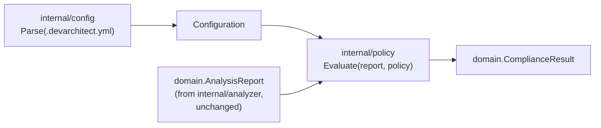

# RFC-001: Engineering Policies

| Field | Value |
|---|---|
| **Status** | Accepted |
| **Authors** | DevArchitect AI maintainers |
| **Created** | 2026-08-04 |
| **Last Updated** | 2026-08-04 |
| **Accepted** | 2026-08-04 — Architecture Review Board (see [Final Decision](#final-decision)) |
| **Target Milestone** | [Milestone 3 — Engineering Policies](../roadmap/roadmap.md#milestone-3--engineering-policies) — status remains `In Design`; implementation has not started |
| **Related issues/PRs** | — |
| **Related ADRs** | [ADR-004](../adr/ADR-004-modular-rule-engine.md), [ADR-005](../adr/ADR-005-transparent-deterministic-scoring.md) |

## Table of contents

- [Summary](#summary)
- [Motivation](#motivation)
- [Goals](#goals)
- [Non-Goals](#non-goals)
- [Terminology](#terminology)
- [Current Behavior](#current-behavior)
- [Proposed Design](#proposed-design)
- [User Experience](#user-experience)
- [Configuration](#configuration)
- [Data Model](#data-model)
- [CLI Behavior](#cli-behavior)
- [Error Handling](#error-handling)
- [Security and Privacy](#security-and-privacy)
- [Backward Compatibility](#backward-compatibility)
- [Migration Strategy](#migration-strategy)
- [Performance Considerations](#performance-considerations)
- [Testing Strategy](#testing-strategy)
- [Documentation Impact](#documentation-impact)
- [Alternatives Considered](#alternatives-considered)
- [Risks and Mitigations](#risks-and-mitigations)
- [Open Questions](#open-questions)
- [Implementation Plan](#implementation-plan)
- [Acceptance Criteria](#acceptance-criteria)
- [Future Work](#future-work)
- [Final Decision](#final-decision)

## Summary

This RFC proposes **Engineering Policies**: a versioned, declarative
configuration file (`.devarchitect.yml`) that lets an organization define
its own required rules and score thresholds, and evaluates a
**Compliance** result — separate from the existing deterministic
**Score** — against them. It defines the v1 schema, a new
`internal/policy` package that evaluates compliance without coupling
`internal/scoring` or `internal/analyzer` to configuration, CLI support
(`--config`, autodetection, `--fail-below`, `policy validate`), CI-ready
exit codes, and a backward-compatible JSON report extension. It does not
implement any of this — see [Implementation Plan](#implementation-plan)
and the sprint restriction that produced this document.

## Motivation

DevArchitect AI today (Milestones 0-2) detects facts, evaluates rules,
computes a deterministic score, and produces recommendations — but it has
no way to express that *this organization* requires `SEC-001` to pass
regardless of overall score, or that *this organization*'s bar for
Documentation is 80%, not whatever DevArchitect AI's default scoring
happens to produce. A [Score](../vision/glossary.md#overall-score) is a
generic, repository-intrinsic measurement; it is not, by itself, a
statement about whether a specific organization's expectations are met
— see [Score vs. Compliance](../vision/glossary.md#score-vs-compliance).

This is DevArchitect AI's primary persona's core need. The [Center of
Excellence](../product/personas.md#center-of-excellence-coe) persona — the project's central design
target per [Vision](../vision/vision.md#who-are-its-users) — exists
specifically to define and drive adoption of engineering standards across
many teams, and today has no way to encode those standards into
DevArchitect AI at all; every organization gets the same built-in rules
with the same implicit expectations. The [Standards
compliance](../product/use-cases.md#standards-compliance) and [CI
pipeline gate](../product/use-cases.md#ci-pipeline-gate) use cases are
both explicitly blocked on this milestone today.

Without this, DevArchitect AI remains a useful per-repository diagnostic
but cannot become the governance layer described in
[Vision](../vision/vision.md) — a published standard stays a document
nobody re-reads, not something measured and enforced.

## Goals

- Let an organization mark specific rules as required, and fail
  Compliance when a required rule doesn't pass.
- Let an organization enable/disable individual rules.
- Let an organization set minimum score thresholds, overall and
  per-category.
- Produce a machine-readable Compliance result (pass/fail plus specific
  violations) usable as a CI gate, with clear, conventional exit codes.
- Keep the existing deterministic Score computation completely
  unaffected when no policy is configured — this is strictly additive.
- Keep `internal/scoring` and `internal/analyzer` unaware that
  configuration or policy exists at all.

## Non-Goals

This RFC explicitly does not propose, and Milestone 3 will not ship:

- Plugins or externally-loaded rule code (Milestone 4).
- Arbitrary expressions or a programmable policy language — Policy
  Requirements are a fixed, small vocabulary (required/enabled,
  thresholds), not a scripting surface.
- Policy inheritance from a remote source, or policies downloaded from
  the internet — see [Security and Privacy](#security-and-privacy).
- Centralized, multi-repository, or multi-organization policy management
  (Milestone 9, Enterprise Edition).
- Multiple named policy profiles within one file (e.g. "strict" vs.
  "lenient" modes) — one policy, one evaluation, in v1.
- Time-bound exceptions or waivers with expiration dates.
- Cryptographic signing of policy files.
- Any SaaS or cloud component (Milestone 8).
- Any AI involvement in policy evaluation — Compliance evaluation is as
  deterministic as scoring itself (see [Deterministic
  Analysis](../vision/glossary.md#deterministic-analysis)).
- Dynamically-generated or conditional rules.

## Terminology

This RFC is what fixes the official definitions of **Engineering
Standard**, **Engineering Policy**, **Policy Requirement**, **Threshold**,
**Compliance**, and **Configuration** — see
[docs/vision/glossary.md](../vision/glossary.md#policy-and-compliance-terms),
written alongside this RFC specifically so this document and the glossary
agree from the start. Two distinctions from that glossary are load-bearing
throughout this RFC and worth restating:

- **[Rule vs. Policy](../vision/glossary.md#rule-vs-policy):** a Rule is
  DevArchitect AI's technical check; a Policy is one organization's
  interpretation of Rule results. This RFC never lets a Policy change
  what a Rule checks.
- **[Score vs. Compliance](../vision/glossary.md#score-vs-compliance):** a
  repository can score 90/100 and still be non-compliant with a Policy
  that requires a specific rule that repository fails. The two are always
  reported side by side, never merged into one number.

## Current Behavior

As of Milestone 2 (verified against `master` at the time of writing):

- `devarchitect analyze <path>` always runs all 17 rules from
  `rules.DefaultRules()`. There is no way to disable, require, or
  threshold any of them.
- `internal/analyzer.Run` takes a `Repository`, a `[]domain.Rule`, and a
  tool version — nothing about organizational expectations.
- The CLI recognizes exactly two `analyze` flags: `--format` and
  `--output` (see `cmd/devarchitect/main.go`'s `parseAnalyzeArgs`).
- Exit codes are `0` (success) or `1` (any error, including a normal
  "path doesn't exist" user error) — undifferentiated.
- The JSON report contains `metadata`, `repository`, `summary`,
  `categoryScores`, `findings`, `recommendations` — no policy or
  compliance concept exists.
- `internal/config` exists as an empty, reserved package with no code.

## Proposed Design

### Package structure

This RFC proposes **two** new packages, not one, deliberately mirroring
the existing `internal/analyzer` / `internal/scoring` split (orchestration
vs. pure computation — see [Separation of
concerns](../vision/design-principles.md#separation-of-concerns)):

- **`internal/config`** (the already-reserved package): parses and
  validates `.devarchitect.yml` into a `Configuration` value. Knows
  nothing about `domain.AnalysisReport`, `domain.Finding`, or scoring.
- **`internal/policy`** (new): evaluates a `Configuration`'s policy
  against an already-computed `domain.AnalysisReport`, producing a
  `domain.ComplianceResult`. Knows nothing about YAML, file I/O, or the
  CLI.



This requires one new dependency edge not present in
[components.md](../architecture/components.md#dependency-rules) today:
`internal/policy` → `internal/domain` (for `AnalysisReport`/`Finding`) and
`internal/policy` → `internal/config` (for `Configuration`). Both are
consistent with the existing rule ("every package may depend on
`internal/domain`"; a new package depending on one sibling is the same
shape as `internal/analyzer` → `internal/scoring` today). **This RFC
proposes amending `components.md`'s table to add `internal/config` and
`internal/policy` as new rows** when Milestone 3 implementation begins.

### How disabling a rule actually removes its points from the denominator

The scoring/policy decision "disabling a rule eliminates its points from
the denominator" (given as a fixed decision for this RFC — see [Scoring
and Policy](#scoring-and-policy-decisions) below) is achieved **without
any change to `internal/scoring` or `internal/analyzer`**: the CLI
(`cmd/devarchitect`), after loading a `Configuration`, filters
`rules.DefaultRules()` down to the enabled subset *before* calling
`analyzer.Run`. `internal/analyzer` and `internal/scoring` continue to
operate exactly as they do today, over whatever `[]domain.Rule` they're
given — they remain fully unaware that a policy disabled anything. This
is the mechanism that satisfies "avoid coupling policies with the
reporter or the CLI['s core packages]": the coupling exists only in
`cmd/devarchitect`'s composition logic, never inside the deterministic
engine.

A disabled rule therefore produces **no `Finding` at all** in a policy-
scoped run — it's simply never evaluated. This is different from a
[Skipped Rule](../vision/glossary.md#skipped-rule) (which *is* evaluated,
and explains why it doesn't apply). To keep this transparent rather than
silent, the proposed JSON `policy` section includes an explicit
`disabledRules` list (see [Data Model](#data-model)).

## User Experience

```bash
# No configuration: behaves exactly as today.
devarchitect analyze .

# Explicit config path.
devarchitect analyze . --config .devarchitect.yml

# Autodetected — .devarchitect.yml at the repository root is used
# automatically if present, with no flag needed.
devarchitect analyze .

# Override just the overall threshold, with or without a config file.
devarchitect analyze . --fail-below 75

# Validate configuration without running a full analysis.
devarchitect policy validate --config .devarchitect.yml
```

Example terminal output with a policy active (illustrative):

```
DevArchitect AI

Repository: example-api
...
Overall Score: 82/100

Policy: .devarchitect.yml (v1)
Compliance: FAILED

Violations:
  REQUIRED-RULE  SEC-001   required rule failed (Security policy exists)
  THRESHOLD      overall   score 82 is below required threshold 85

...
```

## Configuration

Proposed v1 schema — a lightly adjusted version of the example in this
RFC's originating discussion (see [Alternatives
Considered](#alternatives-considered) for what changed and why):

```yaml
version: 1

project:
  name: devarchitect-ai   # optional; informational only in v1

rules:
  DOC-001:
    required: true

  SEC-001:
    required: true

  AI-001:
    enabled: false

thresholds:
  overall: 75

  categories:
    documentation: 80
    security_foundations: 70

compliance:
  fail_on:
    - required_rule_failure
    - threshold_failure
```

**Evaluation of this schema (as requested):** the structure is sound and
is adopted with only one clarification, not a redesign: `rules.<ID>`
accepts `required` and/or `enabled` independently, and `required: true`
without an explicit `enabled: false` implies the rule stays enabled — the
combination `required: true` with `enabled: false` is rejected as invalid
configuration at load time (see [Scoring and Policy
decisions](#scoring-and-policy-decisions)). No structural change to the
proposed shape was needed; it maps cleanly onto the domain model below.

Category keys under `thresholds.categories` (e.g. `documentation`,
`security_foundations`) are validated against
`domain.Category`'s string values (see
`internal/domain/category.go`) — an unrecognized category name is a
configuration error (see [Error Handling](#error-handling)).

## Data Model

Proposed new types, evaluated against and adjusted from the sketch in
this RFC's originating discussion (see inline notes):

```go
// internal/config — the parsed shape of .devarchitect.yml.
// Depends only on internal/domain (for Category validation).

type Configuration struct {
    Version int
    Project ProjectConfig
    Policy  Policy
}

type ProjectConfig struct {
    Name string
}

type Policy struct {
    Rules      map[string]RulePolicy // keyed by Rule ID, e.g. "SEC-001"
    Thresholds ThresholdPolicy
    Compliance CompliancePolicy
}

// RulePolicy uses pointers so "not set in YAML" is distinguishable from
// "explicitly false" — required for correct validation (e.g. detecting
// required+disabled) and for v1's strict-unknown-field parsing (see
// Error Handling).
type RulePolicy struct {
    Required *bool
    Enabled  *bool
}

type ThresholdPolicy struct {
    Overall    *int
    Categories map[string]int // domain.Category string -> minimum percentage
}

type CompliancePolicy struct {
    FailOn []domain.ViolationType
}
```

```go
// internal/domain — additions alongside the existing Finding/AnalysisReport
// types, since these describe report *contract* shapes, the same way
// Finding and Summary do today.

type ComplianceStatus string

const (
    CompliancePassed ComplianceStatus = "passed"
    ComplianceFailed ComplianceStatus = "failed"
)

type ViolationType string

const (
    ViolationRequiredRuleFailure  ViolationType = "required_rule_failure"
    ViolationThresholdFailure     ViolationType = "threshold_failure"
)

// PolicyViolation is deliberately close to the shape proposed in this
// RFC's originating discussion, unchanged: it already reads cleanly
// against existing domain.Finding conventions (an ID/Code, a Category,
// an Expected/Actual pair, a human Message).
type PolicyViolation struct {
    Code     string
    Type     ViolationType
    RuleID   string        // empty for a threshold violation
    Category Category      // zero value for an overall-threshold violation
    Expected string
    Actual   string
    Message  string
}

type ComplianceResult struct {
    Status             ComplianceStatus
    Source             string   // e.g. ".devarchitect.yml"
    Version            int
    DisabledRules      []string // rule IDs excluded by policy — see Proposed Design
    Violations         []PolicyViolation
    CategoryThresholds []CategoryThresholdResult // see "Category threshold status" below
}
```

```go
// internal/policy — pure evaluation, no I/O, mirroring internal/scoring's
// shape (a single exported function, deterministic, tested with
// hand-built domain values).

func Evaluate(report domain.AnalysisReport, policy config.Policy) domain.ComplianceResult
```

**Adjustment from the original sketch:** the original `Policy` struct
combined configuration shape and a `Version` field in one type; this
proposal separates `Configuration` (the full parsed file, including
`Version` and `Project`) from `Policy` (just the policy content), because
`internal/policy.Evaluate` only ever needs the policy content, not the
file's own metadata — keeping its signature minimal per [Small
interfaces](../vision/design-principles.md#small-interfaces).

### Category threshold status

**Added per Architecture Review Board decision** (see [Final
Decision](#final-decision), items 2 and 3) — this refines the original
proposal's handling of a category threshold with no applicable rules
(e.g. every rule in that category disabled by policy) from an informal
"explicit note" into a distinct, structured, visible state:

```go
type CategoryThresholdStatus string

const (
    CategoryThresholdPassed        CategoryThresholdStatus = "passed"
    CategoryThresholdFailed        CategoryThresholdStatus = "failed"
    CategoryThresholdNotApplicable CategoryThresholdStatus = "not_applicable"
)

type CategoryThresholdResult struct {
    Category  Category
    Threshold int
    Actual    int // ignored by consumers when Status is not_applicable
    Status    CategoryThresholdStatus
}
```

`internal/policy.Evaluate` produces one `CategoryThresholdResult` per
category that has a configured threshold, always — not only on failure —
so a category's threshold outcome is never merely absent from the report.
`not_applicable` means the category had zero applicable rules to measure
(see [Applicable Rule](../vision/glossary.md#applicable-rule)) and is
**not** a violation and **not** a pass: no `PolicyViolation` is generated
for it, but it must never be rendered or interpreted as `passed` by the
terminal renderer, the JSON consumer, or a CI script — the Board's
explicit concern was that silence or a default-true reading here would
let a fully-disabled category masquerade as compliant. The overall
`ComplianceResult.Status` is unaffected by a `not_applicable` category
threshold in the same way it's unaffected by a
[Skipped Rule](../vision/glossary.md#skipped-rule): neither penalizes nor
inflates it.

## CLI Behavior

Recommended v1 scope (see [Open Questions](#open-questions) for the
reasoning on what's deferred):

| Command/flag | v1? | Notes |
|---|---|---|
| `devarchitect analyze . --config <path>` | Yes | Explicit path, highest priority. |
| Autodetection of `.devarchitect.yml` at the repository root | Yes | Used when `--config` isn't passed and the file exists; silently absent otherwise (falls back to today's unconfigured behavior). |
| `devarchitect analyze . --fail-below <n>` | Yes | Overrides `thresholds.overall`; works with or without a config file (see [Overrides](#the-fail-below-override) below). |
| `devarchitect policy validate` | Yes | Parses and validates configuration only; does not run analysis. |
| `devarchitect policy explain` | **No — deferred.** | Would explain how a given repository's report maps onto policy decisions; postponed to avoid scope growth in v1 (see [Future Work](#future-work)). |

### The fail-below override

**Recommendation (adopted from this RFC's originating discussion):**
`--fail-below` is an explicit override of `thresholds.overall` — it never
combines additively, and it never errors out just because a config file
also sets `thresholds.overall`. When both are present, `--fail-below`
wins for the overall threshold specifically; per-category thresholds from
the config file are unaffected. The terminal and JSON output both state
explicitly when an override was applied (e.g. `"overall threshold
overridden by --fail-below: 75 (config specified 70)"`), so the effective
policy is never ambiguous to the reader.

## Error Handling

Configuration errors are distinguished explicitly, per the originating
discussion's list, and are all: deterministic, written to `stderr`,
never producing a partial JSON report on `stdout`, and never proceeding
to run Compliance evaluation against an invalid configuration.

| Error | Example | Exit code |
|---|---|---|
| Invalid YAML | Malformed syntax | 2 |
| Unsupported schema version | `version: 2` before v2 exists | 2 |
| Unknown category | `thresholds.categories.frontend: 80` | 2 |
| Unknown rule ID | `rules.DOC-999: {required: true}` | 2 |
| Threshold out of range | `thresholds.overall: 150` | 2 |
| Contradictory configuration | `required: true` + `enabled: false` on the same rule | 2 |
| Unreadable file | Permission denied, path is a directory | 2 |
| Duplicate/ambiguous keys | Same rule ID or category key repeated (YAML-level) | 2 |
| Unknown YAML field | A typo'd key not in the schema | 2 (see [Open Questions](#open-questions) #6) |

Where possible, errors report the offending key's location (line/column,
if the chosen YAML library exposes it — see
[Dependencies](#risks-and-mitigations)) so a user isn't left guessing
which of several rules or thresholds is malformed.

## Security and Privacy

Consistent with [ADR-003](../adr/ADR-003-local-first-read-only.md):

- Configuration is read from a local file only — `--config <path>` or
  autodetection at the repository root.
- No URL is ever resolved; there is no "extends" or "import" mechanism
  pointing outside the local file in v1 (see Non-Goals).
- No command is ever executed as a result of loading or evaluating a
  policy.
- Environment variable interpolation into configuration values is not
  supported in v1 — a policy's meaning must be fully determined by the
  file's own content, not ambient process state, to keep evaluation
  reproducible (see [Deterministic
  Analysis](../vision/glossary.md#deterministic-analysis)).
- No arbitrary file inclusion is supported — `.devarchitect.yml` is a
  single, self-contained file in v1.

## Backward Compatibility

- `devarchitect analyze .` with no `.devarchitect.yml` present and no
  `--config`/`--fail-below` flags **must** produce byte-identical output
  and the same exit code (`0` on success, `1` on error) as it does on
  `master` today — this is the RFC's central compatibility guarantee and
  should be the first thing any implementation's test suite proves.
- The JSON report's new `policy` field is additive; existing consumers
  that ignore unknown top-level fields are unaffected (`encoding/json`'s
  default unmarshal behavior for a Go consumer already ignores unknown
  fields, and any JSON consumer following normal practice does too).
- Exit code `0`/`1` semantics change only when a policy is active *and*
  distinguishes analysis failure from policy failure — see [Alternatives
  Considered](#alternatives-considered) for why a 4-value scheme was
  chosen over overloading `0`/`1`.

## Migration Strategy

There is no prior `.devarchitect.yml` to migrate — this is a net-new
surface. This section instead commits to how it *will* evolve, since a
configuration file is exactly the kind of persistent, externally-
authored artifact [Governance](../governance/governance.md#breaking-changes)
requires a migration story for even at introduction:

- `version: 1` is the only supported value at launch. The config loader
  rejects any other value with a clear "unsupported schema version"
  error (see [Error Handling](#error-handling)) rather than guessing.
- A future `version: 2` (if ever needed) will be additive-first: new
  optional fields should not require a version bump at all (see [Open
  Questions](#open-questions) #6 on unknown-field handling, which
  constrains how additive changes must be introduced — likely via an
  explicit "reserved for future use" allowlist rather than silently
  accepting anything unrecognized). A version bump is reserved for a
  change that alters the *meaning* of an existing field, not merely adds
  a new one.
- A deprecated field (once any exist) is documented as deprecated in its
  release's notes and continues to function for at least one minor
  release before removal, printing a one-line deprecation notice to
  `stderr` when used — consistent with
  [Governance](../governance/governance.md#breaking-changes)'s
  deprecation-period expectation.

## Performance Considerations

Configuration parsing and policy evaluation are expected to be
negligible relative to repository scanning — a `.devarchitect.yml` file
is small (tens of lines) and policy evaluation is a linear pass over at
most 17 findings (today) plus a handful of threshold checks. No
performance risk is anticipated; this should still be confirmed with a
benchmark during implementation rather than assumed.

## Testing Strategy

Required before this RFC's design is considered complete, per the
originating discussion's list:

- Valid configuration (each schema element, individually and combined).
- Invalid configuration: each error category in [Error
  Handling](#error-handling) individually.
- Unknown rule ID; unknown category.
- Required rule: `passed`, `failed`, and `error` status cases (see
  [Scoring and Policy decisions](#scoring-and-policy-decisions)).
- Disabled rule: confirmed absent from `Findings` and present in
  `policy.disabledRules`.
- Overall threshold; per-category threshold; a category with zero
  applicable rules under an active threshold (see [Open
  Questions](#open-questions) #2).
- `--fail-below` override: with no config, with a config that also sets
  `thresholds.overall`, confirming override semantics.
- Autodetection: file present, file absent, `--config` explicitly
  overriding autodetection.
- No configuration at all: byte-identical output to current `master`
  behavior (the central compatibility test — see [Backward
  Compatibility](#backward-compatibility)).
- JSON output: schema validity, additive-only shape, `policy` section
  correctness.
- Exit codes: all four values, exercised individually.
- Regression protection: the full existing Milestone 0-2 test suite must
  continue passing unmodified.
- `go test -race ./...` across all new packages.
- Fixtures: small, purpose-built `.devarchitect.yml` files under
  `testdata/`, one per scenario — consistent with [testing.md](../engineering/testing.md#fixtures)'s
  existing fixture policy, not one large "kitchen sink" config.

## Documentation Impact

On acceptance and implementation, this RFC requires updates to: the
README (`Usage`, a new `Policy and compliance` section, updated
`Known limitations`), [docs/vision/glossary.md](../vision/glossary.md)
(already written; confirm no drift once implemented),
[docs/architecture/components.md](../architecture/components.md) (new
`internal/config`/`internal/policy` rows), a new ADR recording the final
accepted schema and domain model (superseding this RFC's proposal once
implemented — see
[decision-hierarchy.md](../governance/decision-hierarchy.md#how-code-relates-to-documentation)),
and [CLAUDE.md](../../CLAUDE.md) (a new "How to Evaluate Policy Changes"
section, analogous to "How to Write Rules").

## Alternatives Considered

- **Use JSON instead of YAML for `.devarchitect.yml`**, avoiding a new
  dependency entirely (`encoding/json` is standard library). Rejected:
  YAML's support for comments and its lower syntactic noise matter for a
  file humans (not just tools) author and review in a pull request — a
  policy file is closer to a `Makefile` or CI config in spirit than an
  API payload. The dependency cost is evaluated honestly in [Risks and
  Mitigations](#risks-and-mitigations) rather than dismissed.
- **Overload existing exit codes 0/1** instead of introducing 2/3.
  Rejected: a CI pipeline needs to distinguish "your repository doesn't
  meet policy" (an actionable, expected outcome) from "DevArchitect AI
  itself couldn't run" (a tooling problem) — collapsing them into exit
  code `1` would make CI scripts unable to tell a real policy failure
  from a config typo without parsing output text.
- **Have `internal/analyzer` or `internal/scoring` accept policy
  directly** (e.g. `Run(ctx, repo, rules, version, policy)`). Rejected:
  this would couple the deterministic core to configuration, contradicts
  this RFC's explicit goal of keeping those packages unaware of policy,
  and was avoided successfully by filtering the rule set in
  `cmd/devarchitect` before calling `analyzer.Run` instead (see [Proposed
  Design](#proposed-design)).
- **Merge Score and Compliance into one adjusted number** (e.g. a
  "compliance-weighted score"). Rejected outright: this directly
  contradicts [Score vs.
  Compliance](../vision/glossary.md#score-vs-compliance) and would make
  it impossible to see the underlying, policy-independent Score at all
  — a core transparency regression.
- **Do nothing (stay with built-in rules only)**. Rejected: this leaves
  DevArchitect AI's primary persona (Center of Excellence) permanently
  unable to encode organization-specific standards, which
  [Vision](../vision/vision.md#five-year-vision) commits to solving.

## Risks and Mitigations

- **Risk:** Introducing a YAML parsing dependency is DevArchitect AI's
  first-ever external dependency (see [ADR-001](../adr/ADR-001-use-go.md)'s
  zero-dependency starting position). **Mitigation:** evaluate narrowly —
  `gopkg.in/yaml.v3` (or an equivalent) is one of the most widely used Go
  libraries in existence (used by Kubernetes, Helm, Docker tooling, and
  much of the Go ecosystem's own configuration handling), has a
  permissive license (MIT/Apache-2.0 dual), a long stability track
  record, and is used here for parsing only — a narrow, well-understood
  surface. This RFC recommends evaluating exactly one library at
  implementation time and documenting the choice in a dedicated ADR, per
  [CONTRIBUTING.md](../../CONTRIBUTING.md#conventions)'s dependency
  justification requirement. **This RFC does not add the dependency —
  that happens, if at all, in the implementation PR, with its own
  justification.**
- **Risk:** A schema mistake in v1 is expensive to correct once
  organizations depend on `.devarchitect.yml` in their own CI. **Mitigation:**
  the strict-unknown-field rejection (see [Open Questions](#open-questions)
  #6) and the narrow v1 scope (see Non-Goals) are both deliberately
  chosen to keep the surface small and correctable — a small, strict
  schema is far easier to extend safely than a large, permissive one is
  to correct.
- **Risk:** Scope creep toward Milestone 4 (Plugin System) capabilities
  during implementation (e.g. "let's just allow a small expression
  language while we're in here"). **Mitigation:** the Non-Goals section
  above is the explicit gate — any such addition requires a *new* RFC,
  not an amendment to this one during implementation.
- **Risk:** `--fail-below` and `.devarchitect.yml` disagreeing could
  confuse a user. **Mitigation:** explicit "overridden by" messaging in
  both terminal and JSON output (see [Overrides](#the-fail-below-override)).

## Open Questions

**All seven questions below are resolved** — the Architecture Review
Board approved this RFC's recommendation for each on 2026-08-04; see
[Final Decision](#final-decision) for the authoritative, numbered list
these resolutions correspond to. Each question is preserved verbatim
(struck through nothing, deleted nothing) with its resolution recorded
directly beneath it, consistent with this RFC not being a place to erase
its own history of what was asked.

1. **Should a rule's `Impact` be modifiable from policy?**

   **Status: ✅ Resolved** (see [Final Decision](#final-decision) #1).
   **Decision: No, not in schema version 1.** **Reasoning:** `Impact`
   only affects recommendation ordering (see
   [ADR-005](../adr/ADR-005-transparent-deterministic-scoring.md)), and
   letting Policy override a Rule-declared property blurs [Rule vs.
   Policy](../vision/glossary.md#rule-vs-policy) for a purely cosmetic
   effect. Revisit only with real, demonstrated demand, via a new RFC.

2. **Should a category with no applicable rules (e.g., fully disabled by
   policy) pass, fail, or be not-applicable against a category
   threshold?**

   **Status: ✅ Resolved** (see [Final Decision](#final-decision) #2-3).
   **Decision: `not_applicable`, and it is a distinct, visible state —
   never treated as passed.** **Reasoning:** the Board strengthened this
   RFC's original recommendation (an "explicit note") into a structured,
   always-present result per category
   (`CategoryThresholdResult` — see [Category threshold
   status](#category-threshold-status)), specifically to prevent a
   fully-disabled category from silently reading as compliant to a
   downstream consumer or CI script that only checks for the absence of
   a violation.

3. **How should Compliance treat a required rule that ends in an `error`
   Finding?**

   **Status: ✅ Resolved** (see [Final Decision](#final-decision) #4).
   **Decision: it produces a policy violation (non-compliant).**
   **Reasoning:** an error means DevArchitect AI could not confirm the
   requirement was met — a required rule fails closed, not open,
   consistent with the [Scoring and Policy
   decisions](#scoring-and-policy-decisions) stated in this RFC's
   original proposal.

4. **Should `--fail-below` work without a configuration file at all?**

   **Status: ✅ Resolved** (see [Final Decision](#final-decision) #5).
   **Decision: yes.** **Reasoning:** it's a simple, self-contained
   override — a direct comparison against `Summary.OverallScore` —
   useful as a lightweight CI gate on its own, and it doesn't require
   any `internal/policy`/`Configuration` machinery to implement.

5. **Should `devarchitect policy validate` exist from v1?**

   **Status: ✅ Resolved** (see [Final Decision](#final-decision) #6).
   **Decision: yes, included in Milestone 3.** **Reasoning:** validating
   configuration without running a full analysis is cheap to implement
   (it's a subset of the `--config` loading path) and high-value for
   CI/pre-commit use.

6. **Should the parser reject unknown YAML fields?**

   **Status: ✅ Resolved** (see [Final Decision](#final-decision) #7).
   **Decision: yes, strictly.** **Reasoning:** silently ignoring a
   typo'd key (e.g. `requiredd: true`) in a compliance-critical file is
   a dangerous silent failure mode — strict parsing surfaces mistakes
   immediately. Disclosed cost, accepted by the Board: future additive
   schema changes need a documented allowlist strategy (see [Migration
   Strategy](#migration-strategy)) rather than "just add a field and old
   versions ignore it."

7. **Should Policy support required rules, or would thresholds alone be
   sufficient?**

   **Status: ✅ Resolved** (see [Final Decision](#final-decision) #8).
   **Decision: support both.** **Reasoning:** thresholds can't express
   "this one rule is non-negotiable regardless of the overall score"
   (e.g. "a security policy file must always exist, even if every other
   category is perfect") — required rules and thresholds serve distinct,
   complementary organizational needs, and the motivating use cases (see
   [Motivation](#motivation)) need both.

### Scoring and Policy decisions

These were stated as settled decisions in this RFC's original proposal
(not open questions), and are now confirmed, unchanged, by the
Architecture Review Board — see [Final Decision](#final-decision) items
9-11. Restated here for completeness since they shape the Data Model and
Error Handling sections above:

- Disabling a rule removes its points from the scoring denominator (see
  [Proposed Design](#proposed-design) for the filtering mechanism that
  achieves this without coupling `internal/scoring` to policy).
- A required rule that fails generates a `PolicyViolation`.
- A required rule with status `error` cannot be considered compliant
  (see Open Question 3 above).
- A rule marked both `required: true` and `enabled: false` is invalid
  configuration, rejected at load time.
- Thresholds must be between 0 and 100 inclusive; outside that range is
  a configuration error.
- A category with no applicable rules is handled explicitly, not
  silently (see Open Question 2 above).
- Policy must never silently change a rule's declared `MaxScore` in v1 —
  the only policy-driven effect on scoring is exclusion (via disabling),
  never adjustment of an individual rule's point value.

## Implementation Plan

1. `internal/config`: `Configuration`/`Policy` types, YAML parsing (once
   a dependency is chosen and justified in its own ADR), strict
   validation per [Error Handling](#error-handling).
2. `internal/domain`: `ComplianceResult`, `ComplianceStatus`,
   `PolicyViolation`, `ViolationType` additions.
3. `internal/policy`: `Evaluate(report, policy) ComplianceResult`, fully
   unit-tested against hand-built `domain.AnalysisReport` values (no
   real scan needed, consistent with [testing.md](../engineering/testing.md)).
4. `cmd/devarchitect`: `--config`, autodetection, `--fail-below`,
   `policy validate` subcommand, rule-set filtering, exit code logic.
5. `internal/report`: JSON `policy` section rendering; terminal
   Compliance/Violations rendering.
6. Update `components.md`'s dependency table; write the ADR recording the
   as-implemented schema and domain model; update README and CLAUDE.md.
7. This can ship as a single increment (the surface area is small enough
   not to need a flag-gated rollout) once steps 1-6 are complete and
   tested.

## Acceptance Criteria

This RFC is ready for Architecture Review Board approval when — self-
assessed below, confirmed met by the Board; see [Final
Decision](#final-decision):

- [x] Terminology is consistent with
      [docs/vision/glossary.md](../vision/glossary.md).
- [x] Rules, Scoring, Policy, and Compliance are kept clearly separated
      (see [Proposed Design](#proposed-design) and
      [Terminology](#terminology)).
- [x] The v1 schema is clearly defined (see
      [Configuration](#configuration)).
- [x] CLI behavior is clearly defined (see [CLI Behavior](#cli-behavior)).
- [x] Exit codes are clearly defined (see [Error Handling](#error-handling)).
- [x] Validation behavior is clearly defined (see [Error
      Handling](#error-handling)).
- [x] Backward compatibility is addressed (see [Backward
      Compatibility](#backward-compatibility)).
- [x] A migration strategy is included (see [Migration
      Strategy](#migration-strategy)).
- [x] Risks and alternatives are included (see [Alternatives
      Considered](#alternatives-considered), [Risks and
      Mitigations](#risks-and-mitigations)).
- [x] No AI involvement is proposed anywhere in this design.
- [x] No code is implemented by this RFC.

## Future Work

- `devarchitect policy explain` — a command that walks a user through
  exactly why a repository is or isn't compliant, in more narrative
  detail than the `violations` list alone.
- Policy schema `version: 2`, whenever a change requires it (see
  [Migration Strategy](#migration-strategy)).
- Multiple named policy profiles (deferred per Non-Goals).
- Time-bound exceptions/waivers (deferred per Non-Goals) — a real need
  once organizations start using required rules in practice and need a
  documented, temporary escape hatch.
- Feeding `ComplianceResult` into Milestone 7's CI/CD integrations (PR
  status checks, PR comments).

## Final Decision

**The Architecture Review Board approved this RFC on 2026-08-04**, per
the approval authority and process defined in
[Governance](../governance/governance.md#rfc-approval). Status changes
from `Draft` to **Accepted**. Acceptance is not a timeline commitment —
implementation has not started; [Milestone
3](../roadmap/roadmap.md#milestone-3--engineering-policies) remains
status `In Design`, not `In Progress`, until an implementation increment
actually begins (see
[decision-hierarchy.md](../governance/decision-hierarchy.md#which-artifact-updates-first)).

The Board approved the following twelve decisions, which now constitute
this RFC's binding design for Milestone 3. Each is a decision this
document already proposed or asked about — see the linked section for
full context; this list is the authoritative summary other documents
should link to rather than restate (see
[decision-hierarchy.md](../governance/decision-hierarchy.md#what-each-layer-must-not-contain)).

1. **Rule impact cannot be overridden by policy in schema version 1** —
   resolves [Open Question 1](#open-questions).
2. **A category with no applicable rules is reported as
   `not_applicable`** — resolves [Open Question 2](#open-questions).
3. **`not_applicable` is a distinct visible state and must not be
   treated as passed** — hardens the resolution of [Open Question
   2](#open-questions); see the [Category threshold
   status](#category-threshold-status) addition to the Data Model.
4. **A required rule ending with status `error` produces a policy
   violation** — resolves [Open Question 3](#open-questions).
5. **`--fail-below` works without a configuration file** — resolves
   [Open Question 4](#open-questions).
6. **`policy validate` is included in Milestone 3** — resolves [Open
   Question 5](#open-questions).
7. **Unknown YAML fields are rejected** — resolves [Open Question
   6](#open-questions).
8. **Policies support both required rules and score thresholds** —
   resolves [Open Question 7](#open-questions).
9. **`required: true` combined with `enabled: false` is invalid
   configuration** — confirms the [Scoring and Policy
   decisions](#scoring-and-policy-decisions) stated in this RFC's
   original proposal.
10. **Disabling a rule removes its points from the applicable score
    denominator** — confirms [Scoring and Policy
    decisions](#scoring-and-policy-decisions) and the [rule-set
    filtering mechanism](#how-disabling-a-rule-actually-removes-its-points-from-the-denominator)
    in Proposed Design.
11. **Policy version 1 cannot silently modify a rule's declared
    `MaxScore`** — confirms [Scoring and Policy
    decisions](#scoring-and-policy-decisions).
12. **`--fail-below` explicitly overrides only the overall threshold and
    must be disclosed in the report output** — confirms [The fail-below
    override](#the-fail-below-override).

Terminology used above and throughout this RFC's resolutions remains
consistent with [docs/vision/glossary.md](../vision/glossary.md); no new
term introduced by these decisions (`not_applicable`) required a change
to existing glossary entries — it is a state of a [Threshold](../vision/glossary.md#threshold)
evaluation, not a new top-level concept, and is documented as such in
[Category threshold status](#category-threshold-status) below.

This RFC is now ready to govern Milestone 3 implementation. Any
implementation pull request that deviates from a decision listed above
must either conform or return here with an amending RFC — see [How code
relates to
documentation](../governance/decision-hierarchy.md#how-code-relates-to-documentation).
